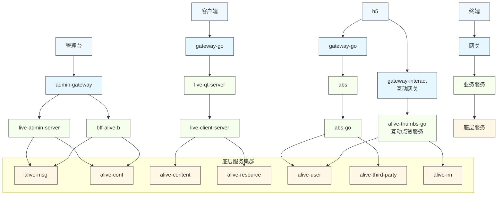

# 系统架构流程图

```mermaid
flowchart TD
    %% 样式定义
    classDef topLayer fill:#f0f8ff,stroke:#333,stroke-width:1px
    classDef gatewayLayer fill:#e6f7ff,stroke:#333,stroke-width:1px
    classDef businessLayer fill:#f6ffed,stroke:#333,stroke-width:1px
    classDef baseLayer fill:#fff7e6,stroke:#333,stroke-width:1px

    %% 顶层入口节点
    terminal[终端]:::topLayer
    admin[管理台]:::topLayer
    client[客户端]:::topLayer
    h5[h5]:::topLayer

    %% 网关层（新增交互网关）
    gateway[网关]:::gatewayLayer
    admin_gateway[admin-gateway]:::gatewayLayer
    gateway_go[gateway-go]:::gatewayLayer
    gateway_go_h5[gateway-go]:::gatewayLayer
    gateway_interact[gateway-interact<br/>互动网关]:::gatewayLayer

    %% 业务服务层（新增互动业务服务）
    business_service[业务服务]:::businessLayer
    live_admin_server[live-admin-server]:::businessLayer
    bff_alive_b[bff-alive-b]:::businessLayer
    live_qt_server[live-qt-server]:::businessLayer
    live_client_server[live-client-server]:::businessLayer
    abs[abs]:::businessLayer
    abs_go[abs-go]:::businessLayer
    alive_thumbs_go[alive-thumbs-go<br/>互动点赞服务]:::businessLayer

    %% 底层服务层
    base_service[底层服务]:::baseLayer
    subgraph 底层服务集群
        alive_msg[alive-msg]:::baseLayer
        alive_conf[alive-conf]:::baseLayer
        alive_content[alive-content]:::baseLayer
        alive_resource[alive-resource]:::baseLayer
        alive_user[alive-user]:::baseLayer
        alive_third_party[alive-third-party]:::baseLayer
        alive_imp[alive-im]:::baseLayer
    end

    %% 链路1：管理台 -> admin-gateway -> live-admin-server -> bff-alive-b -> 底层服务
    admin --> admin_gateway
    admin_gateway --> live_admin_server
    admin_gateway --> bff_alive_b
    live_admin_server --> alive_msg
    live_admin_server --> alive_conf
    bff_alive_b -->alive_msg
    bff_alive_b --> alive_conf

    %% 链路2：客户端 -> gateway-go -> live-qt-server -> live-client-server -> 底层服务
    client --> gateway_go
    gateway_go --> live_qt_server
    live_qt_server --> live_client_server
    live_client_server --> alive_content
    live_client_server --> alive_resource

    %% 链路3：h5基本业务 -> gateway-go -> abs -> abs-go -> 底层服务
    h5 --> gateway_go_h5
    gateway_go_h5 --> abs
    abs --> abs_go
    abs_go --> alive_user
    abs_go --> alive_third_party

    %% 链路4：h5营销、交付业务 -> gateway_interact -> alive_thumbs_go -> 底层服务
    h5 --> gateway_interact
    gateway_interact --> alive_thumbs_go
    alive_thumbs_go --> alive_imp
    alive_thumbs_go --> alive_user

    %% 左侧占位模块（和原图对齐）
    terminal --> gateway
    gateway --> business_service
    business_service --> base_service
```
